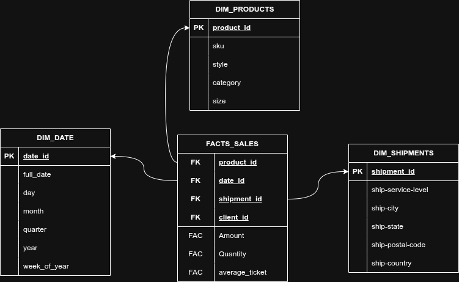

# Justificación del esquema de modelado implementado

### 1. ¿Por qué se eligió un esquema estrella y no una tabla plana o un esquema copo de nieve?
Elegí el **modelado de estrella** ya que es un modelo mucho más **sencillo**, lo que facilita la creación de reportes. 
Además, al no estar **normalizadas** las tablas de dimensiones, el rendimiento es mucho mmás rapido, lo que agiliza el 
tiempo de respuesta al momento de hacer consultas.

### 2. ¿Qué diferencia hay entre una base OLTP y una base OLAP, y por qué RetailCo necesita ambas?
RetailCo necesita tener bases dedicadas para cada sistema de gestión, ya que OLTP y OLAP están pensados para distintos 
propósitos. 

El OLTP, por su parte, para lo que nos sirve es para garantizar la integridad y rapidez de las operaciones diarias 
(ventas, registros de nuevos clientes, pagos, etcétera), por lo que está optimizada para escritura rápida 
(INSERT, UPDATE, DELETE), además de que se hace uso de la normalización para evitar duplicados y datos sucios. 

Mientras tanto, el OLAP es el sistema de gestión que se encarga del análisis de grandes volúmenes de datos. 
Las escrituras no son individuales ni constantes, sino que se realizan mediante cargas masivas de datos; este tipo de 
gestión está pensada para métodos como ETL/ELT y scripts de limpieza de datos. 

RetailCo necesita ambas porque no puede arriesgarse a que una consulta pesada de reportes ralentice las ventas en las 
tiendas. Al tener ambos sistemas, la empresa asegura que su operación diaria sea fluida en el OLTP, mientras que sus
analistas pueden extraer conclusiones estratégicas del OLAP sin interferir con el negocio.

### 3. ¿Qué columnas del dataset original quedaron fuera del modelo y por qué?
Dejé afuera columnas como index y Unnamed: 22 porque no aportan nada y son mayormente son datos sucios. También a la 
columna currency, ya que todos los montos están en la misma moneda, y promotion-ids, porque los datos estaban muy 
sucios y no aportan valor directo al análisis de ventas que buscamos ahora.